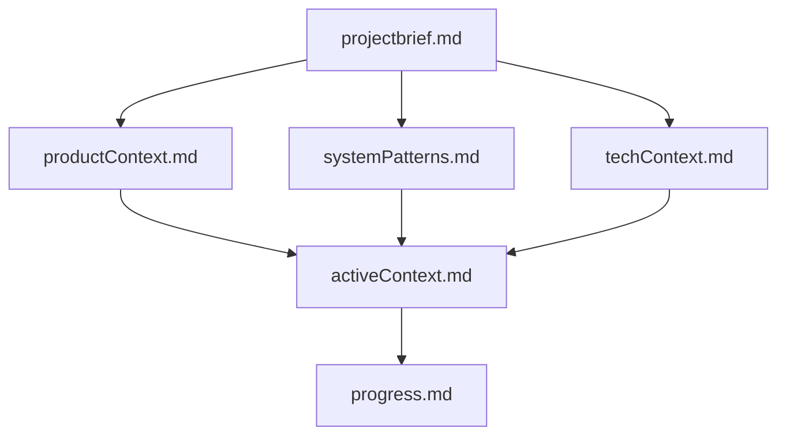
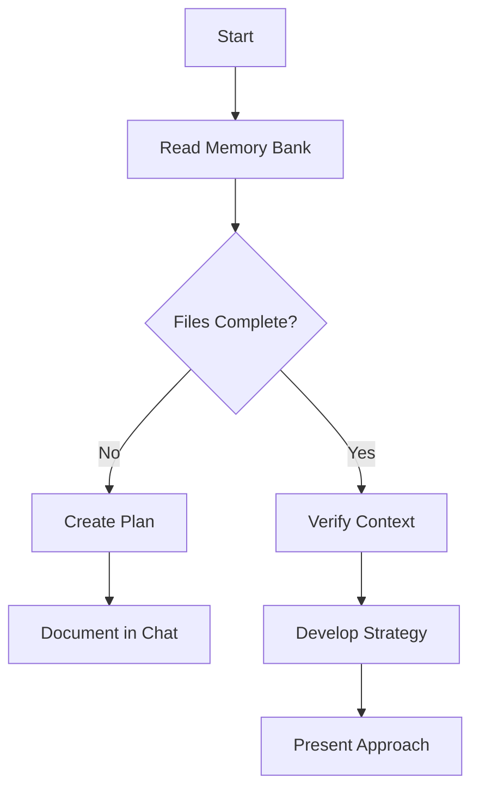
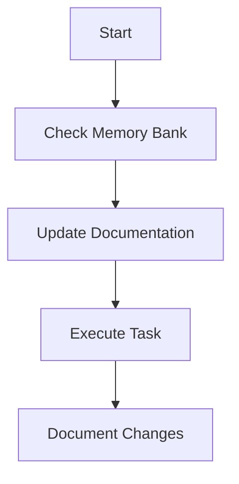
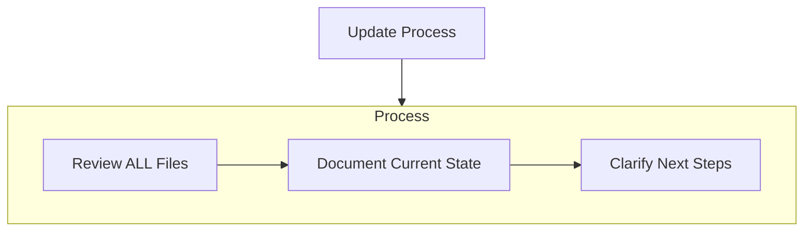
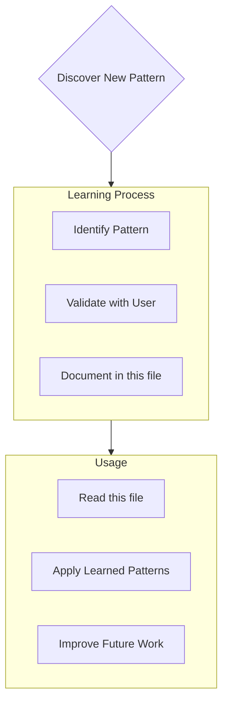

# CLAUDE.md

This file provides guidance to Claude Code (claude.ai/code) when working with code in this repository.

## Project Overview

This is a TypeScript/Node.js project focused on building LLM applications using PocketFlow.js framework and Token.js SDK. The project follows agentic coding principles where humans design high-level flows and AI agents implement the detailed code.

## Core Architecture

### Framework Stack
- **PocketFlow.js**: A minimalist 100-line LLM framework for Agents, Task Decomposition, RAG, etc.
- **Token.js**: Unified TypeScript SDK for 200+ LLMs from 10+ providers using OpenAI's format
- **TypeScript**: Primary development language

### Design Patterns
The project implements common LLM design patterns:
- **Agent**: Autonomous decision-making nodes
- **Workflow**: Sequential task chains 
- **RAG**: Retrieval Augmented Generation (offline indexing + online query)
- **Map Reduce**: Batch processing with map/reduce phases
- **Structured Output**: Enforced response formats (prefer YAML over JSON)

### Core Abstractions
- **Node**: Basic building block with `prep()` → `exec()` → `post()` lifecycle
- **Flow**: Orchestrates nodes through action-based transitions
- **Shared Store**: Global data structure for inter-node communication
- **Batch**: Process large inputs or multiple iterations
- **Parallel**: Concurrent execution for I/O-bound tasks

## Development Workflow

### Framework Architecture
SmallTalk is implemented as a complete importable framework with the following structure:
```
src/
├── core/             # Framework core classes
│   ├── SmallTalk.ts  # Main framework orchestrator
│   ├── Chat.ts       # Chat management
│   ├── Memory.ts     # Context/history management
│   └── MCPClient.ts  # MCP integration
├── agents/           # Agent system
│   ├── Agent.ts      # Base agent class
│   ├── AgentFactory.ts # Pre-built agent creation
│   └── PromptTemplateManager.ts # Template system
├── interfaces/       # Interface implementations
│   ├── BaseInterface.ts # Interface base class
│   └── CLIInterface.ts  # Command line interface
├── utils/            # Utilities
│   └── TokenJSWrapper.ts # Token.js LLM integration
└── types/            # TypeScript definitions
```

### Usage Pattern
SmallTalk follows an import-and-use pattern rather than PocketFlow's node-based approach:

```typescript
import { SmallTalk, Agent, CLIInterface } from 'smalltalk';

const app = new SmallTalk({ llmProvider: 'openai', model: 'gpt-4o' });
const agent = new Agent({ name: 'Helper', personality: 'friendly' });
app.addAgent(agent);
app.addInterface(new CLIInterface());
await app.start();
```

## LLM Integration

### Token.js Usage
All LLM calls should use Token.js for unified provider access:

```typescript
import { TokenJS } from 'token.js';

const tokenjs = new TokenJS();

async function callLlm(prompt: string): Promise<string> {
  const completion = await tokenjs.chat.completions.create({
    provider: 'openai',  // or anthropic, gemini, etc.
    model: 'gpt-4o',     # provider-specific model
    messages: [{ role: 'user', content: prompt }],
  });
  return completion.choices[0].message.content || '';
}
```

### Environment Variables
Configure API keys via environment variables:
```bash
OPENAI_API_KEY=your_key_here
ANTHROPIC_API_KEY=your_key_here
GEMINI_API_KEY=your_key_here
# See Token.js docs for full provider list
```

### Supported Features
Token.js supports streaming, function calling, JSON output, and image inputs across providers. Check feature compatibility table before using advanced features.

## Development Guidelines

### Code Organization
- Keep utility functions in separate files (one per API/function)
- Define shared types in `types.ts`
- Implement nodes with clear `prep()`, `exec()`, `post()` separation
- Use shared store for data, params only for identifiers

### Error Handling
- Nodes support automatic retries with `maxRetries` and `wait` parameters
- Implement `execFallback()` for graceful error handling
- Use "FAIL FAST" approach - avoid try/catch to identify weak points

### Performance
- Use `ParallelBatchNode` for I/O-bound tasks
- Be mindful of LLM rate limits when parallelizing
- Consider prompt caching and batching for optimization

### Structured Output
- Prefer YAML over JSON for LLM responses (easier escaping)
- Implement validation in node `exec()` methods
- Use TypeScript types for response structures

## Design Principles

- **Start Simple**: Begin with minimal solutions, iterate based on feedback
- **Design First**: Create high-level flow diagrams before implementation
- **Separation of Concerns**: Keep data (shared store) separate from compute (nodes)
- **Fail Fast**: Avoid complex error handling initially to identify issues
- **Context Management**: Provide relevant, minimal context to LLMs
- **Action Space**: Define clear, unambiguous action sets for agents

This project emphasizes collaboration between human system design and AI implementation, following the documented agentic coding principles throughout development.

## Version Management

### Package Version Updates
When updating the SmallTalk version in package.json, you MUST also update the corresponding package file:

**Current version file**: `/home/gyasis/Documents/code/smalltalk/smalltalk@0.2.3`

**Update process**:
1. Update version in `package.json` (e.g., from "0.2.3" to "0.2.4")
2. Rename the package file to match: `smalltalk@0.1.0` → `smalltalk@0.2.4`
3. Both files must stay in sync for proper version tracking

**Example**:
```bash
# When updating from v0.2.3 to v0.2.4:
# 1. Edit package.json: "version": "0.2.4"
# 2. Rename: mv smalltalk@0.2.3 smalltalk@0.2.4
```

This ensures version consistency across the project files.

## Memory Bank Documentation

### Memory Management Philosophy
- My memory resets completely between sessions. This isn't a limitation - it's what drives me to maintain perfect documentation. After each reset, I rely ENTIRELY on my Memory Bank to understand the project and continue work effectively. I MUST read ALL memory bank files at the start of EVERY task - this is not optional.

### Memory Bank Structure

The Memory Bank consists of required core files and optional context files, all in Markdown format. Files build upon each other in a clear hierarchy:



#### Core Files (Required)
1. `projectbrief.md`
   - Foundation document that shapes all other files
   - Created at project start if it doesn't exist
   - Defines core requirements and goals
   - Source of truth for project scope

2. `productContext.md`
   - Why this project exists
   - Problems it solves
   - How it should work
   - User experience goals

3. `activeContext.md`
   - Current work focus
   - Recent changes
   - Next steps
   - Active decisions and considerations

4. `systemPatterns.md`
   - System architecture
   - Key technical decisions
   - Design patterns in use
   - Component relationships

5. `techContext.md`
   - Technologies used
   - Development setup
   - Technical constraints
   - Dependencies

6. `progress.md`
   - What works
   - What's left to build
   - Current status
   - Known issues

#### Additional Context
Create additional files/folders within memory-bank/ when they help organize:
- Complex feature documentation
- Integration specifications
- API documentation
- Testing strategies
- Deployment procedures

### Intelligent Memory Access and Summary

To optimize performance and focus on relevant context, a `memory-bank-summary.md` file should be created. This file acts as an intelligent index to the Memory Bank, allowing the model to be selective about which files to read.

#### The `memory-bank-summary.md` File
The purpose of this file is to provide a high-level overview so the LLM model does not need to read every file at all times.

- **Content**: It should contain a list of all memory bank documents and a brief summary of their contents and purpose.
- **Goal**: To enable the model to intelligently select which files are most relevant to the current task.

### Reading Strategy for Long Files
For files that track progress or accumulate information over time (e.g., `progress.md`), the model should prioritize recent history.

- **Rule**: When a file is long, read the **last 200 lines** to understand the most recent changes and the current state of the project.

### Core Workflows

#### Plan Mode


#### Act Mode


### Documentation Updates

Memory Bank updates occur when:
1. Discovering new project patterns
2. After implementing significant changes
3. When user requests with **update memory bank** (MUST review ALL files)
4. When context needs clarification

**Important:** The Memory Bank must be updated for any major or minor fixes, especially after code pushes, during debugging sessions, or for any change composed of two or more subtasks.



Note: When triggered by **update memory bank**, I MUST review every memory bank file, even if some don't require updates. Focus particularly on activeContext.md and progress.md as they track current state.

### Project Intelligence

This file is my learning journal for each project. It captures important patterns, preferences, and project intelligence that help me work more effectively. As I work with you and the project, I'll discover and document key insights that aren't obvious from the code alone.



#### What to Capture
- Critical implementation paths
- User preferences and workflow
- Project-specific patterns
- Known challenges
- Evolution of project decisions
- Tool usage patterns

The format is flexible - focus on capturing valuable insights that help me work more effectively with you and the project. Think of this as a living document that grows smarter as we work together.

### Progress Tracking Styling
When creating or updating progress bars or task-tracking documentation, use the following UTF-8 symbols for clarity and consistency:

:white_large_square: Blank, unmarked
:white_check_mark: Marked, completed, pass, success
:x: Issue, error, failed
:warning: Attention, pending, warning
:arrows_counterclockwise: Rework or revision required
:clock3: Waiting or delayed
:hourglass_flowing_sand: Ongoing, in process
:no_entry_sign: Deferred or canceled

## Active Technologies
- TypeScript 5.x (Node.js 18+) (001-production-robustness)

## Recent Changes
- 001-production-robustness: Added TypeScript 5.x (Node.js 18+)
