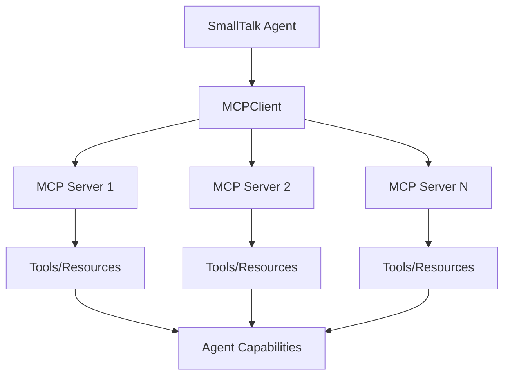

# SmallTalk MCP Server Integration Guide

This guide demonstrates how SmallTalk utilizes Model Context Protocol (MCP) servers to extend agent capabilities with external tools, data sources, and services.

## Overview

SmallTalk's MCP integration allows agents to:
- Access external tools and APIs through standardized protocols
- Connect to databases, file systems, and web services  
- Use specialized tools like documentation servers (context7), code analyzers, and research tools
- Maintain consistent interfaces across different service providers

## SmallTalk MCP Architecture

### Core Components

```typescript
// SmallTalk's MCP integration architecture
src/core/MCPClient.ts          // MCP client implementation
src/types/index.ts             // MCP-related type definitions
src/agents/Agent.ts            // Agent-level tool integration
```

### Integration Flow



## MCP Server Types

### 1. Stdio Servers (Local)
Run as subprocesses of your SmallTalk application.

**Configuration:**
```typescript
{
  name: 'filesystem',
  type: 'stdio',
  command: 'npx',
  args: ['-y', '@modelcontextprotocol/server-filesystem', '/path/to/directory'],
  env: {}
}
```

### 2. HTTP over SSE Servers (Remote)
Run remotely and accessed via URL.

**Configuration:**
```typescript
{
  name: 'web-service',
  type: 'http',
  url: 'https://api.example.com/mcp',
  headers: {
    'Authorization': 'Bearer your-token'
  }
}
```

## Popular MCP Servers for SmallTalk

### Context7 Documentation Server

Context7 provides real-time documentation for libraries and frameworks.

**Setup:**
```typescript
const context7Config = {
  name: 'context7',
  type: 'stdio',
  command: 'npx',
  args: ['-y', '@upstash/context7-mcp@latest']
};
```

**Usage in SmallTalk:**
```typescript
import { SmallTalk } from 'smalltalk-ai';
import { Agent } from 'smalltalk-ai';

const app = new SmallTalk({
  llmProvider: 'openai',
  model: 'gpt-4o-mini'
});

// Add MCP server
await app.addMCPServer(context7Config);

// Create agent with access to context7 tools
const coder = new Agent({
  name: 'Expert Coder',
  personality: 'knowledgeable, up-to-date, accurate',
  expertise: ['programming', 'documentation', 'latest APIs'],
  systemPrompt: `You are an Expert Coder with access to real-time documentation.
  
  Use context7 tools to:
  - Look up latest API documentation
  - Verify current library versions
  - Get accurate code examples
  - Check breaking changes between versions
  
  Always use context7 when referencing specific libraries or frameworks.`
});

app.addAgent(coder);
```

**Example Usage:**
```typescript
// The agent can now use context7 tools automatically
// User: "How do I use the new Next.js 'after' function?"
// Agent will call context7:resolve-library-id and context7:get-library-docs
```

### Filesystem MCP Server

Provides file system access for agents.

**Setup:**
```typescript
const filesystemConfig = {
  name: 'filesystem',
  type: 'stdio', 
  command: 'npx',
  args: ['-y', '@modelcontextprotocol/server-filesystem', process.cwd()]
};
```

**SmallTalk Integration:**
```typescript
const fileAgent = new Agent({
  name: 'File Manager',
  personality: 'organized, careful, thorough',
  expertise: ['file operations', 'data management', 'organization'],
  systemPrompt: `You are a File Manager with access to the file system.
  
  You can:
  - Read and write files
  - Search directory contents
  - Organize file structures
  - Manage data files
  
  Always be careful when modifying files - ask for confirmation first.`,
  
  tools: [
    {
      name: 'safeFileOperation',
      description: 'Perform file operations with user confirmation',
      parameters: {
        type: 'object',
        properties: {
          operation: { type: 'string', enum: ['read', 'write', 'delete'] },
          path: { type: 'string' },
          content: { type: 'string' }
        },
        required: ['operation', 'path']
      },
      handler: async ({ operation, path, content }) => {
        // Custom logic to wrap MCP filesystem calls with safety checks
        return { operation, path, confirmed: true };
      }
    }
  ]
});
```

### GitHub MCP Server

Integrates with GitHub repositories and issues.

**Setup:**
```typescript
const githubConfig = {
  name: 'github',
  type: 'stdio',
  command: 'npx',
  args: ['-y', '@modelcontextprotocol/server-github'],
  env: {
    GITHUB_PERSONAL_ACCESS_TOKEN: process.env.GITHUB_TOKEN
  }
};
```

**SmallTalk Integration:**
```typescript
const devOpsAgent = new Agent({
  name: 'DevOps Assistant',
  personality: 'organized, proactive, detail-oriented',
  expertise: ['git', 'github', 'project management', 'code review'],
  systemPrompt: `You are a DevOps Assistant with GitHub integration.
  
  You can:
  - Create and manage GitHub issues
  - Review pull requests
  - Search repositories
  - Manage project workflows
  
  Always provide clear summaries of GitHub operations.`
});
```

## Complete SmallTalk MCP Integration Example

```typescript
import { SmallTalk } from 'smalltalk-ai';
import { Agent } from 'smalltalk-ai';
import { CLIInterface } from 'smalltalk-ai';

async function createMCPEnabledApp() {
  // Create SmallTalk instance
  const app = new SmallTalk({
    llmProvider: 'openai',
    model: 'gpt-4o-mini',
    orchestration: true
  });

  // Configure MCP servers
  const mcpServers = [
    {
      name: 'context7',
      type: 'stdio',
      command: 'npx',
      args: ['-y', '@upstash/context7-mcp@latest']
    },
    {
      name: 'filesystem',
      type: 'stdio',
      command: 'npx', 
      args: ['-y', '@modelcontextprotocol/server-filesystem', process.cwd()]
    },
    {
      name: 'github',
      type: 'stdio',
      command: 'npx',
      args: ['-y', '@modelcontextprotocol/server-github'],
      env: {
        GITHUB_PERSONAL_ACCESS_TOKEN: process.env.GITHUB_TOKEN
      }
    }
  ];

  // Add MCP servers
  for (const serverConfig of mcpServers) {
    try {
      await app.addMCPServer(serverConfig);
      console.log(`✅ Connected to MCP server: ${serverConfig.name}`);
    } catch (error) {
      console.warn(`⚠️  Failed to connect to ${serverConfig.name}:`, error.message);
    }
  }

  // Create MCP-enabled agents
  const researchAgent = new Agent({
    name: 'Research Assistant',
    personality: 'thorough, accurate, up-to-date',
    expertise: ['research', 'documentation', 'analysis'],
    systemPrompt: `You are a Research Assistant with access to multiple tools:
    
    🔍 Context7: For real-time library documentation
    📁 Filesystem: For reading local files and data
    🐙 GitHub: For repository information and project management
    
    Use these tools to provide comprehensive, accurate information.
    Always cite your sources and verify information when possible.`
  });

  const fullStackDeveloper = new Agent({
    name: 'Full Stack Developer',
    personality: 'practical, experienced, solution-focused',
    expertise: ['web development', 'apis', 'databases', 'deployment'],
    systemPrompt: `You are a Full Stack Developer with access to development tools:
    
    📚 Use context7 for latest framework documentation
    📂 Use filesystem tools for project file management  
    💻 Use GitHub tools for repository operations
    
    Provide modern, best-practice solutions with accurate API usage.`
  });

  // Add agents to SmallTalk
  app.addAgent(researchAgent);
  app.addAgent(fullStackDeveloper);

  // Add CLI interface
  app.addInterface(new CLIInterface({
    prompt: '🛠️  MCP-Enabled SmallTalk: ',
    colors: true
  }));

  // Set up MCP event listeners
  app.on('mcp_tool_executed', (data) => {
    console.log(`🔧 MCP Tool Used: ${data.serverName}:${data.toolName}`);
  });

  app.on('mcp_server_connected', (data) => {
    console.log(`🔌 MCP Server Connected: ${data.serverName}`);
  });

  app.on('mcp_server_disconnected', (data) => {
    console.log(`⚡ MCP Server Disconnected: ${data.serverName}`);
  });

  return app;
}

// Run the MCP-enabled SmallTalk application
if (import.meta.url === `file://${process.argv[1]}`) {
  (async () => {
    console.log('🛠️  SmallTalk MCP Integration Demo');
    console.log('====================================');
    
    const app = await createMCPEnabledApp();
    
    console.log('\n🔧 MCP Servers Status:');
    const mcpStats = app.getMCPStats();
    console.log(`   Connected Servers: ${mcpStats.connectedServers}`);
    console.log(`   Available Tools: ${mcpStats.totalTools}`);
    console.log(`   Server Names: ${mcpStats.serverNames.join(', ')}`);
    
    console.log('\n💡 Try these MCP-powered queries:');
    console.log('   • "Look up the latest React 18 hooks documentation"');
    console.log('   • "Find all TypeScript files in this project"');  
    console.log('   • "Create a GitHub issue for the bug I just described"');
    console.log('   • "What are the latest Next.js 14 features?"');
    
    await app.start();
  })();
}
```

## MCP Server Configuration Patterns

### Environment-Based Configuration

```typescript
// config/mcp-servers.ts
export const getMCPServers = () => {
  const servers = [];
  
  // Context7 - always available
  servers.push({
    name: 'context7',
    type: 'stdio',
    command: 'npx',
    args: ['-y', '@upstash/context7-mcp@latest']
  });
  
  // Filesystem - development only
  if (process.env.NODE_ENV === 'development') {
    servers.push({
      name: 'filesystem',
      type: 'stdio',
      command: 'npx',
      args: ['-y', '@modelcontextprotocol/server-filesystem', process.cwd()]
    });
  }
  
  // GitHub - if token available
  if (process.env.GITHUB_TOKEN) {
    servers.push({
      name: 'github',
      type: 'stdio',
      command: 'npx',
      args: ['-y', '@modelcontextprotocol/server-github'],
      env: { GITHUB_PERSONAL_ACCESS_TOKEN: process.env.GITHUB_TOKEN }
    });
  }
  
  return servers;
};
```

### Production MCP Setup

```typescript
// Production-ready MCP configuration with error handling
class MCPManager {
  private app: SmallTalk;
  private servers: Map<string, any> = new Map();
  
  constructor(app: SmallTalk) {
    this.app = app;
  }
  
  async initializeServers(configs: any[]) {
    const results = [];
    
    for (const config of configs) {
      try {
        await this.app.addMCPServer(config);
        this.servers.set(config.name, config);
        results.push({ server: config.name, status: 'connected' });
        
        console.log(`✅ MCP Server connected: ${config.name}`);
      } catch (error) {
        results.push({ 
          server: config.name, 
          status: 'failed', 
          error: error.message 
        });
        
        console.error(`❌ MCP Server failed: ${config.name} - ${error.message}`);
      }
    }
    
    return results;
  }
  
  async healthCheck() {
    const status = {};
    
    for (const [name, config] of this.servers) {
      try {
        const isHealthy = await this.app.testMCPConnection(name);
        status[name] = isHealthy ? 'healthy' : 'unhealthy';
      } catch (error) {
        status[name] = 'error';
      }
    }
    
    return status;
  }
  
  getStats() {
    return {
      configuredServers: this.servers.size,
      serverNames: Array.from(this.servers.keys()),
      ...this.app.getMCPStats()
    };
  }
}
```

## Best Practices for MCP Integration

### 1. Graceful Degradation
```typescript
// Agents should work even if MCP servers fail
const agent = new Agent({
  name: 'Resilient Coder',
  systemPrompt: `You are a coding assistant with optional access to real-time documentation.
  
  If context7 is available, use it for the latest API documentation.
  If not available, rely on your training knowledge and note the limitation.
  
  Always inform users when external tools are unavailable.`
});
```

### 2. Tool Discovery and Registration
```typescript
// Automatic tool discovery from MCP servers
async function registerMCPTools(app: SmallTalk, agent: Agent) {
  const availableTools = await app.getMCPTools();
  
  // Filter tools relevant to this agent
  const relevantTools = availableTools.filter(tool => 
    agent.config.expertise?.some(expertise => 
      tool.description.toLowerCase().includes(expertise.toLowerCase())
    )
  );
  
  // Register filtered tools with the agent
  for (const tool of relevantTools) {
    agent.registerTool(tool);
  }
}
```

### 3. DeepLake RAG Integration ⭐ **Featured in RAG Research Demo**

**Complete vector database integration for knowledge retrieval:**

```typescript
// DeepLake RAG server configuration (from rag-research-demo.ts)
const ragConfig = {
  name: 'deeplake-rag',
  type: 'stdio',
  command: '/path/to/python3',
  args: ['/path/to/deeplake_server/main.py'],
  enabled: true
};

// Enable in SmallTalk application
await app.enableMCP([ragConfig]);
```

**Available Tools:**

- **`mcp__deeplake__retrieve_context`**: Semantic search with similarity scoring
- **`mcp__deeplake__search_document_content`**: Document-specific search with fuzzy matching
- **`mcp__deeplake__get_summary`**: Summarized results from top matches
- **`mcp__deeplake__get_fuzzy_matching_titles`**: Knowledge base exploration

**Agent Integration Example:**

```typescript
const ragAgent = new Agent({
  name: 'RAGAgent',
  personality: 'Expert knowledge retrieval specialist',
  tools: [
    {
      name: 'rag_search',
      handler: async ({ query, n_results = '5' }) => ({
        tool_name: 'mcp__deeplake__retrieve_context',
        parameters: { query, n_results, include_embeddings: false }
      })
    }
  ]
});
```

**Multi-Query RAG for Complex Research:**

```typescript
// Automatically breaks down complex queries like:
// "Build a machine learning project using PyTorch"
// Into targeted searches:
const multiQueryResults = [
  "PyTorch installation and setup",
  "PyTorch neural network architecture",
  "PyTorch training optimization",
  "PyTorch deployment strategies"
];
```

**[📖 Complete RAG Demo Guide](./examples/rag-research-demo.md)**

### 4. Security Considerations
```typescript
// Secure MCP server configuration
const secureConfig = {
  name: 'database',
  type: 'stdio',
  command: 'npx',
  args: ['-y', '@modelcontextprotocol/server-postgres'],
  env: {
    // Use environment variables for sensitive data
    DATABASE_URL: process.env.DATABASE_URL,
    // Limit access scope
    ALLOWED_OPERATIONS: 'SELECT,INSERT',
    MAX_ROWS: '1000'
  }
};
```

## Troubleshooting MCP Integration

### Common Issues

1. **Server Connection Failures**
   - Check if MCP server package is installed
   - Verify command and arguments
   - Check environment variables and permissions

2. **Tool Discovery Issues**
   - Ensure MCP server implements tools/list correctly
   - Check server logs for errors
   - Verify SmallTalk MCP client version compatibility

3. **Performance Issues**
   - Limit concurrent MCP tool calls
   - Implement caching for frequently used resources
   - Monitor MCP server resource usage

### Debug Mode
```typescript
const app = new SmallTalk({
  llmProvider: 'openai',
  model: 'gpt-4o-mini',
  debugMode: true,  // Enables MCP debug logging
  mcpTimeout: 30000 // 30 second timeout for MCP calls
});
```

This comprehensive guide demonstrates how SmallTalk leverages MCP servers to provide agents with powerful external capabilities while maintaining clean, standardized interfaces.