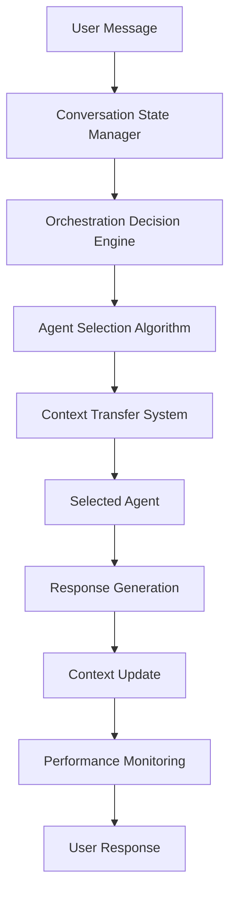

# Multi-Agent Turn-Taking Conversation Orchestration: Complete Implementation Guide

## Overview

This document provides a comprehensive guide to implementing sophisticated multi-agent turn-taking conversation orchestration systems, similar to those used by Phind, Codex CLI, Gemini CLI, and Claude Code. The guide includes detailed PRD specifications, advanced prompt engineering strategies, and practical implementation examples.

## 🎯 Key Components

### 1. Product Requirements Document (PRD)
**Location**: `prd/multi-agent-conversation-orchestration-prd.md`

**Key Features**:
- **Conversation State Management**: Persistent conversation history and context retention
- **Intelligent Turn-Taking Engine**: Natural conversation flow and timing
- **Agent Orchestration System**: Automatic routing and context transfer
- **Multi-Agent Coordination**: Collaborative task execution and debate patterns
- **Performance Monitoring**: Quality assessment and optimization

**Success Metrics**:
- 95% context retention across agent switches
- 90% appropriate response timing
- 85% optimal agent routing
- 4.5/5 user satisfaction rating
- <2 seconds response time

### 2. Advanced Prompt Engineering Guide
**Location**: `docs/prompt-engineering/orchestrator-prompt-guide.md`

**Core Prompt Categories**:
- **Master Orchestrator System Prompt**: Central coordination intelligence
- **Agent Selection Prompt**: Context-aware agent routing
- **Turn-Taking Decision Prompt**: Natural conversation flow management
- **Context Transfer Prompt**: Seamless agent handoffs
- **Multi-Agent Coordination Prompts**: Collaborative task execution

**Advanced Features**:
- Dynamic context adaptation based on urgency, complexity, and user type
- Debate and discussion orchestration
- Collaborative task management
- Performance monitoring and optimization

### 3. Practical Implementation Example
**Location**: `examples/multi-agent-orchestrator-demo.ts`

**Implementation Highlights**:
- Complete TypeScript implementation with SmallTalk framework
- Real-time conversation state management
- Intelligent orchestration decision making
- Context-aware agent routing
- Performance monitoring and optimization

## 🏗️ Architecture Overview

### Core System Components

```typescript
interface ConversationOrchestrationSystem {
  // Core Components
  conversationStateManager: ConversationStateManager;
  turnTakingEngine: TurnTakingEngine;
  agentOrchestrator: AgentOrchestrator;
  contextManager: ContextManager;
  communicationProtocol: CommunicationProtocol;
  
  // Advanced Components
  analyticsEngine: AnalyticsEngine;
  patternLibrary: ConversationPatternLibrary;
  performanceMonitor: PerformanceMonitor;
}
```

### Data Flow Architecture



## 🚀 Implementation Roadmap

### Phase 1: Foundation (Weeks 1-4)
- [ ] Conversation state data models
- [ ] Basic agent orchestration system
- [ ] Simple turn-taking engine
- [ ] Core API endpoints
- [ ] Basic prompt templates

### Phase 2: Advanced Orchestration (Weeks 5-8)
- [ ] Advanced orchestration algorithms
- [ ] Context transfer mechanisms
- [ ] Agent performance monitoring
- [ ] WebSocket real-time communication
- [ ] Advanced prompt engineering

### Phase 3: Multi-Agent Coordination (Weeks 9-12)
- [ ] Debate and discussion patterns
- [ ] Collaborative task execution
- [ ] Consensus-building mechanisms
- [ ] Conversation analytics
- [ ] Performance optimization

### Phase 4: Production Readiness (Weeks 13-16)
- [ ] Performance optimization
- [ ] Monitoring and alerting
- [ ] Documentation and examples
- [ ] Security hardening
- [ ] Load testing and scaling

## 🎭 Conversation Patterns

### 1. Sequential Orchestration
```typescript
// Linear task execution with context carryover
const sequentialFlow = {
  phases: ['planning', 'coding', 'review', 'testing', 'deployment'],
  contextTransfer: 'full',
  handoffStrategy: 'explicit'
};
```

### 2. Collaborative Orchestration
```typescript
// Multiple agents working together on complex tasks
const collaborativeFlow = {
  coordinationType: 'parallel',
  informationSharing: 'real-time',
  consensusBuilding: 'required'
};
```

### 3. Debate and Discussion
```typescript
// Structured debate with facilitator
const debateFlow = {
  rounds: 3,
  facilitator: 'debate-facilitator',
  consensusRequired: true,
  decisionCriteria: 'evidence-based'
};
```

## 🧠 Prompt Engineering Strategies

### 1. Context-Aware Prompting
- **Dynamic Adaptation**: Prompts adapt based on conversation context
- **User Type Recognition**: Different prompts for experts vs. beginners
- **Urgency Handling**: Prompts adjust based on urgency levels
- **Complexity Management**: Prompts scale with task complexity

### 2. Multi-Agent Coordination
- **Structured Communication**: Beyond natural language protocols
- **Context Transfer**: Comprehensive context handoff between agents
- **Performance Monitoring**: Continuous quality assessment
- **Optimization**: Data-driven prompt improvement

### 3. Turn-Taking Intelligence
- **Natural Flow**: Human-like conversation timing
- **Context Awareness**: Response timing based on conversation state
- **User Engagement**: Adaptive pacing based on user behavior
- **Quality Assurance**: Continuous conversation quality monitoring

## 📊 Performance Monitoring

### Key Metrics
- **Conversation Continuity**: 95% context retention target
- **Turn-Taking Accuracy**: 90% appropriate response timing
- **Agent Selection Accuracy**: 85% optimal routing
- **User Satisfaction**: 4.5/5 rating target
- **Response Time**: <2 seconds for orchestration decisions

### Monitoring Dashboard
```typescript
interface PerformanceDashboard {
  conversationMetrics: {
    continuity: number;
    turnTakingAccuracy: number;
    agentSelectionAccuracy: number;
    userSatisfaction: number;
    responseTime: number;
  };
  agentPerformance: {
    [agentId: string]: AgentPerformanceMetrics;
  };
  systemHealth: {
    uptime: number;
    errorRate: number;
    throughput: number;
  };
}
```

## 🔧 Integration with SmallTalk Framework

### Basic Integration
```typescript
import { SmallTalk, Agent } from 'smalltalk-ai';

const app = new SmallTalk({
  orchestration: true,
  llmProvider: 'openai',
  model: 'gpt-4o-mini'
});

// Add specialized agents
app.addAgent(researchAgent);
app.addAgent(codingAgent);
app.addAgent(businessAgent);

// Initialize orchestrator
const orchestrator = new ConversationOrchestrator(app);
```

### Advanced Configuration
```typescript
const app = new SmallTalk({
  orchestration: {
    enabled: true,
    contextSensitivity: 0.8,
    switchThreshold: 0.6,
    maxSwitchesPerConversation: 5,
    learningRate: 0.1,
    customRules: [
      {
        condition: (context, message) => message.includes('urgent'),
        targetAgent: 'Priority Support',
        priority: 20
      }
    ]
  }
});
```

## 🎯 Best Practices

### 1. Conversation State Management
- **Persistent Storage**: Maintain conversation history across sessions
- **Context Compression**: Efficiently manage memory usage
- **State Validation**: Ensure conversation state integrity
- **Recovery Mechanisms**: Handle state corruption gracefully

### 2. Agent Orchestration
- **Performance-Based Selection**: Route based on agent performance history
- **Context-Aware Routing**: Consider conversation context in routing decisions
- **Graceful Degradation**: Handle agent failures gracefully
- **Load Balancing**: Distribute load across available agents

### 3. Prompt Engineering
- **Structured Output**: Use consistent JSON response formats
- **Context Integration**: Include relevant context in every prompt
- **Quality Assurance**: Build validation into prompts
- **Continuous Improvement**: Regularly update prompts based on performance

### 4. Performance Optimization
- **Caching**: Cache frequently used responses and context
- **Parallel Processing**: Execute independent operations in parallel
- **Resource Management**: Efficiently manage system resources
- **Monitoring**: Continuous performance monitoring and alerting

## 🚀 Getting Started

### 1. Install Dependencies
```bash
npm install smalltalk-ai
```

### 2. Set Up Environment
```bash
export OPENAI_API_KEY=your_openai_key
export SMALLTALK_DEBUG=true
export SMALLTALK_ORCHESTRATION=true
```

### 3. Run the Demo
```bash
# CLI mode
smalltalk examples/multi-agent-orchestrator-demo.ts

# Playground mode
smalltalk playground examples/multi-agent-orchestrator-demo.ts
```

### 4. Customize for Your Use Case
- Modify agent configurations
- Adjust orchestration rules
- Customize prompt templates
- Implement domain-specific logic

## 📚 Additional Resources

### Documentation
- [SmallTalk Framework Documentation](./README.md)
- [MCP Server Integration Guide](./docs/mcp-server-integration.md)
- [LLM Integration Guide](./docs/llm-integration-guide.md)

### Examples
- [Language Learning Tutor](./examples/language-tutor.ts)
- [Medical Training System](./examples/medical-tutor.ts)
- [Business Meeting Simulator](./examples/business-meeting.ts)

### API Reference
- [SmallTalk Class](./docs/api-reference/smalltalk.md)
- [Agent Class](./docs/api-reference/agent.md)
- [Orchestrator](./docs/api-reference/orchestrator.md)

## 🎉 Conclusion

This comprehensive guide provides everything needed to implement sophisticated multi-agent turn-taking conversation orchestration systems. The combination of detailed PRD specifications, advanced prompt engineering strategies, and practical implementation examples enables the creation of natural, context-aware, multi-turn conversations that rival the best AI conversation systems available today.

The phased implementation approach ensures steady progress while maintaining quality, and the comprehensive success metrics provide clear targets for evaluation and optimization.

---

**Document Version**: 1.0  
**Last Updated**: January 2025  
**Next Review**: February 2025


