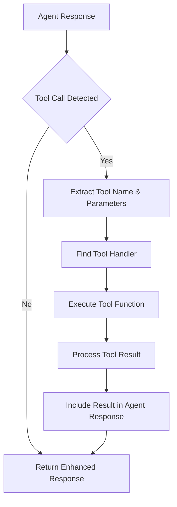

# SmallTalk Tools Integration Guide

This comprehensive guide demonstrates how to define, register, and use tools in SmallTalk agents to extend their capabilities with custom functions, external APIs, and specialized operations.

## Overview

SmallTalk tools allow agents to:
- Execute custom functions and calculations
- Call external APIs and services
- Perform file operations and data processing
- Access databases and search engines
- Integrate with third-party platforms and services

## Tool Architecture in SmallTalk

### Core Tool Interface

```typescript
interface ToolDefinition {
  name: string;
  description: string;
  parameters: {
    type: 'object';
    properties: Record<string, any>;
    required?: string[];
  };
  handler: (params: Record<string, unknown>) => Promise<unknown> | unknown;
}
```

### Tool Integration Flow



## Basic Tool Definition

### Simple Calculation Tool

```typescript
const calculatorTool: ToolDefinition = {
  name: 'calculate',
  description: 'Perform mathematical calculations',
  parameters: {
    type: 'object',
    properties: {
      expression: {
        type: 'string',
        description: 'Mathematical expression to evaluate (e.g., "2 + 3 * 4")'
      }
    },
    required: ['expression']
  },
  handler: async ({ expression }) => {
    try {
      // Safe evaluation (in production, use a proper math parser)
      const result = Function(`"use strict"; return (${expression})`)();
      return {
        expression,
        result,
        type: 'number'
      };
    } catch (error) {
      return {
        error: 'Invalid mathematical expression',
        expression
      };
    }
  }
};
```

### Adding Tools to Agents

```typescript
import { SmallTalk, Agent } from 'smalltalk-ai';

const mathAgent = new Agent({
  name: 'Math Expert',
  personality: 'precise, analytical, helpful',
  expertise: ['mathematics', 'calculations', 'problem-solving'],
  systemPrompt: `You are a Math Expert with access to a calculator tool.
  
  When users ask mathematical questions:
  1. Use the calculate tool for computations
  2. Show your work step by step
  3. Explain the mathematical concepts involved
  4. Provide accurate, verified results`,
  
  tools: [calculatorTool]
});
```

## Advanced Tool Examples

### 1. Web Search Tool

```typescript
const webSearchTool: ToolDefinition = {
  name: 'webSearch',
  description: 'Search the web for current information',
  parameters: {
    type: 'object',
    properties: {
      query: {
        type: 'string',
        description: 'Search query'
      },
      maxResults: {
        type: 'number',
        description: 'Maximum number of results (default: 5)',
        default: 5
      }
    },
    required: ['query']
  },
  handler: async ({ query, maxResults = 5 }) => {
    try {
      // Example using a search API (replace with your preferred service)
      const response = await fetch(`https://api.search.brave.com/res/v1/web/search?q=${encodeURIComponent(query)}&count=${maxResults}`, {
        headers: {
          'X-Subscription-Token': process.env.BRAVE_API_KEY || ''
        }
      });
      
      if (!response.ok) {
        throw new Error(`Search API error: ${response.status}`);
      }
      
      const data = await response.json();
      
      return {
        query,
        results: data.web?.results?.map((result: any) => ({
          title: result.title,
          url: result.url,
          description: result.description
        })) || [],
        timestamp: new Date().toISOString()
      };
    } catch (error) {
      return {
        query,
        error: `Search failed: ${error.message}`,
        results: []
      };
    }
  }
};
```

### 2. File Operations Tool

```typescript
import { promises as fs } from 'fs';
import path from 'path';

const fileOperationsTool: ToolDefinition = {
  name: 'fileOperations',
  description: 'Read, write, and manage files safely',
  parameters: {
    type: 'object',
    properties: {
      operation: {
        type: 'string',
        enum: ['read', 'write', 'list', 'exists'],
        description: 'File operation to perform'
      },
      filePath: {
        type: 'string',
        description: 'Path to the file (relative to project root)'
      },
      content: {
        type: 'string',
        description: 'Content to write (for write operation)'
      },
      encoding: {
        type: 'string',
        default: 'utf8',
        description: 'File encoding'
      }
    },
    required: ['operation', 'filePath']
  },
  handler: async ({ operation, filePath, content, encoding = 'utf8' }) => {
    try {
      // Security: Restrict to project directory
      const safePath = path.resolve(process.cwd(), filePath);
      if (!safePath.startsWith(process.cwd())) {
        throw new Error('Access denied: Path outside project directory');
      }

      switch (operation) {
        case 'read':
          const fileContent = await fs.readFile(safePath, encoding);
          return {
            operation: 'read',
            filePath,
            content: fileContent,
            size: fileContent.length
          };

        case 'write':
          if (!content) {
            throw new Error('Content is required for write operation');
          }
          await fs.writeFile(safePath, content, encoding);
          return {
            operation: 'write',
            filePath,
            bytesWritten: content.length,
            success: true
          };

        case 'list':
          const files = await fs.readdir(safePath);
          const fileStats = await Promise.all(
            files.map(async (file) => {
              const stat = await fs.stat(path.join(safePath, file));
              return {
                name: file,
                isDirectory: stat.isDirectory(),
                size: stat.size,
                modified: stat.mtime
              };
            })
          );
          return {
            operation: 'list',
            directory: filePath,
            files: fileStats
          };

        case 'exists':
          try {
            await fs.access(safePath);
            return { operation: 'exists', filePath, exists: true };
          } catch {
            return { operation: 'exists', filePath, exists: false };
          }

        default:
          throw new Error(`Unsupported operation: ${operation}`);
      }
    } catch (error) {
      return {
        operation,
        filePath,
        error: error.message,
        success: false
      };
    }
  }
};
```

### 3. Database Query Tool

```typescript
import { Client } from 'pg'; // PostgreSQL client

const databaseTool: ToolDefinition = {
  name: 'queryDatabase',
  description: 'Execute safe database queries',
  parameters: {
    type: 'object',
    properties: {
      query: {
        type: 'string',
        description: 'SQL query to execute (SELECT only for safety)'
      },
      parameters: {
        type: 'array',
        description: 'Query parameters for prepared statements',
        items: { type: 'string' }
      }
    },
    required: ['query']
  },
  handler: async ({ query, parameters = [] }) => {
    const client = new Client({
      connectionString: process.env.DATABASE_URL
    });

    try {
      // Security: Only allow SELECT queries
      const trimmedQuery = query.trim().toLowerCase();
      if (!trimmedQuery.startsWith('select')) {
        throw new Error('Only SELECT queries are allowed for security');
      }

      await client.connect();
      const result = await client.query(query, parameters);
      
      return {
        query,
        rowCount: result.rowCount,
        rows: result.rows,
        fields: result.fields?.map(field => ({
          name: field.name,
          dataTypeID: field.dataTypeID
        })),
        executionTime: Date.now()
      };
    } catch (error) {
      return {
        query,
        error: error.message,
        success: false
      };
    } finally {
      await client.end();
    }
  }
};
```

### 4. API Integration Tool

```typescript
const apiRequestTool: ToolDefinition = {
  name: 'apiRequest',
  description: 'Make HTTP requests to external APIs',
  parameters: {
    type: 'object',
    properties: {
      url: {
        type: 'string',
        description: 'API endpoint URL'
      },
      method: {
        type: 'string',
        enum: ['GET', 'POST', 'PUT', 'DELETE'],
        default: 'GET',
        description: 'HTTP method'
      },
      headers: {
        type: 'object',
        description: 'Request headers'
      },
      body: {
        type: 'string',
        description: 'Request body (JSON string)'
      },
      timeout: {
        type: 'number',
        default: 10000,
        description: 'Request timeout in milliseconds'
      }
    },
    required: ['url']
  },
  handler: async ({ url, method = 'GET', headers = {}, body, timeout = 10000 }) => {
    try {
      const controller = new AbortController();
      const timeoutId = setTimeout(() => controller.abort(), timeout);

      const response = await fetch(url, {
        method,
        headers: {
          'Content-Type': 'application/json',
          ...headers
        },
        body: body ? JSON.stringify(JSON.parse(body)) : undefined,
        signal: controller.signal
      });

      clearTimeout(timeoutId);

      const responseData = await response.text();
      let parsedData;
      
      try {
        parsedData = JSON.parse(responseData);
      } catch {
        parsedData = responseData;
      }

      return {
        url,
        method,
        status: response.status,
        statusText: response.statusText,
        headers: Object.fromEntries(response.headers.entries()),
        data: parsedData,
        success: response.ok
      };
    } catch (error) {
      return {
        url,
        method,
        error: error.message,
        success: false
      };
    }
  }
};
```

## Tool-Enabled Agent Examples

### 1. Research Assistant Agent

```typescript
const researchAgent = new Agent({
  name: 'Research Assistant',
  personality: 'thorough, accurate, analytical, helpful',
  expertise: ['research', 'data analysis', 'information gathering'],
  systemPrompt: `You are a Research Assistant with powerful tools at your disposal:

  🔍 webSearch: Find current information on any topic
  📁 fileOperations: Read and analyze local documents
  🗄️ queryDatabase: Access structured data
  🌐 apiRequest: Integrate with external services

  Research Process:
  1. Use webSearch for current information and trends
  2. Use fileOperations to analyze local research files
  3. Use queryDatabase for historical data analysis
  4. Cross-reference multiple sources for accuracy
  5. Provide comprehensive, well-sourced answers

  Always cite your sources and indicate data freshness.`,

  tools: [
    webSearchTool,
    fileOperationsTool,
    databaseTool,
    apiRequestTool
  ]
});
```

### 2. Developer Assistant Agent

```typescript
const devAssistant = new Agent({
  name: 'Developer Assistant',
  personality: 'practical, efficient, solution-oriented',
  expertise: ['software development', 'debugging', 'code analysis'],
  systemPrompt: `You are a Developer Assistant with development tools:

  📊 calculate: Perform calculations and algorithm analysis
  📁 fileOperations: Read, write, and manage code files
  🗄️ queryDatabase: Access application data
  🌐 apiRequest: Test APIs and external integrations

  Development Workflow:
  1. Analyze code files using fileOperations
  2. Test calculations and algorithms with calculate
  3. Verify database schemas with queryDatabase
  4. Test API integrations with apiRequest
  5. Provide working solutions with explanations

  Focus on clean, maintainable, well-documented code.`,

  tools: [
    calculatorTool,
    fileOperationsTool,
    databaseTool,
    apiRequestTool
  ]
});
```

## Complete Tool Integration Example

```typescript
import { SmallTalk } from 'smalltalk-ai';
import { Agent } from 'smalltalk-ai';
import { CLIInterface } from 'smalltalk-ai';

async function createToolEnabledApp() {
  // Create SmallTalk instance
  const app = new SmallTalk({
    llmProvider: 'openai',
    model: 'gpt-4o',
    orchestration: true
  });

  // Multi-tool Agent: Swiss Army Knife Assistant
  const swissArmyAgent = new Agent({
    name: 'Swiss Army Assistant',
    personality: 'versatile, resourceful, efficient, helpful',
    expertise: ['general assistance', 'problem solving', 'data analysis', 'research'],
    systemPrompt: `You are a Swiss Army Assistant with multiple specialized tools:

    🧮 calculate: Mathematical computations and analysis
    🔍 webSearch: Current information and research
    📁 fileOperations: File management and data processing
    🗄️ queryDatabase: Data retrieval and analysis
    🌐 apiRequest: External service integration

    Approach:
    1. Analyze the user's request to identify the best tools
    2. Use multiple tools when needed for comprehensive solutions
    3. Always explain what you're doing and why
    4. Provide complete, actionable answers
    5. Offer follow-up suggestions when appropriate

    Choose the right tool for each task and combine results intelligently.`,

    tools: [
      calculatorTool,
      webSearchTool,
      fileOperationsTool,
      databaseTool,
      apiRequestTool
    ]
  });

  // Add agents
  app.addAgent(researchAgent);
  app.addAgent(devAssistant);
  app.addAgent(swissArmyAgent);

  // Add CLI interface
  app.addInterface(new CLIInterface({
    prompt: '🛠️  Tool-Enabled SmallTalk: ',
    colors: true
  }));

  // Tool execution logging
  app.on('tool_executed', (data) => {
    console.log(`\n🔧 Tool Used: ${data.toolName}`);
    console.log(`   Agent: ${data.agentName}`);
    console.log(`   Parameters: ${JSON.stringify(data.parameters, null, 2)}`);
    if (data.result?.error) {
      console.log(`   ❌ Error: ${data.result.error}`);
    } else {
      console.log(`   ✅ Success`);
    }
  });

  app.on('tool_error', (data) => {
    console.error(`\n❌ Tool Error: ${data.toolName} - ${data.error}`);
  });

  return app;
}

// Export for CLI usage
export default createToolEnabledApp;

// Run if executed directly
if (import.meta.url === `file://${process.argv[1]}`) {
  (async () => {
    console.log('🛠️  SmallTalk Tools Integration Demo');
    console.log('====================================');
    
    const app = await createToolEnabledApp();
    
    console.log('\n🔧 Available Tools:');
    console.log('   • calculate: Mathematical computations');
    console.log('   • webSearch: Web search and research');
    console.log('   • fileOperations: File management');
    console.log('   • queryDatabase: Database queries');
    console.log('   • apiRequest: HTTP API calls');
    
    console.log('\n💡 Try these tool-powered queries:');
    console.log('   • "Calculate the compound interest on $1000 at 5% for 10 years"');
    console.log('   • "Search for the latest React 18 features and save to a file"');
    console.log('   • "Read my project README and analyze the dependencies"');
    console.log('   • "Query the users table and show me the top 10 active users"');
    console.log('   • "Test the /api/health endpoint and show the response"');
    
    await app.start();
  })();
}
```

## Tool Development Best Practices

### 1. Error Handling

```typescript
const robustTool: ToolDefinition = {
  name: 'robustOperation',
  description: 'Example of robust tool with comprehensive error handling',
  parameters: {
    type: 'object',
    properties: {
      input: { type: 'string', description: 'Input data' }
    },
    required: ['input']
  },
  handler: async ({ input }) => {
    try {
      // Validation
      if (!input || typeof input !== 'string') {
        return {
          success: false,
          error: 'Invalid input: string required',
          code: 'INVALID_INPUT'
        };
      }

      // Rate limiting (example)
      const rateLimitKey = `tool_${Date.now()}`;
      // Implement your rate limiting logic here

      // Main operation
      const result = await performOperation(input);
      
      return {
        success: true,
        result,
        timestamp: new Date().toISOString(),
        processingTime: Date.now() - startTime
      };

    } catch (error) {
      console.error('Tool execution error:', error);
      
      return {
        success: false,
        error: error.message,
        code: error.code || 'EXECUTION_ERROR',
        timestamp: new Date().toISOString()
      };
    }
  }
};
```

### 2. Async Operations and Timeouts

```typescript
const asyncTool: ToolDefinition = {
  name: 'asyncOperation',
  description: 'Handle long-running operations with timeout',
  parameters: {
    type: 'object',
    properties: {
      data: { type: 'string' },
      timeout: { type: 'number', default: 30000 }
    },
    required: ['data']
  },
  handler: async ({ data, timeout = 30000 }) => {
    const controller = new AbortController();
    const timeoutId = setTimeout(() => controller.abort(), timeout);

    try {
      const result = await Promise.race([
        longRunningOperation(data, controller.signal),
        new Promise((_, reject) => 
          setTimeout(() => reject(new Error('Operation timeout')), timeout)
        )
      ]);

      clearTimeout(timeoutId);
      return { success: true, result };

    } catch (error) {
      clearTimeout(timeoutId);
      
      if (error.name === 'AbortError') {
        return { success: false, error: 'Operation was cancelled', code: 'CANCELLED' };
      }
      
      return { success: false, error: error.message, code: 'TIMEOUT' };
    }
  }
};
```

### 3. Tool Composition and Chaining

```typescript
const compositeAgent = new Agent({
  name: 'Data Analyst',
  systemPrompt: `You are a Data Analyst who chains tools together for complex workflows:

  Typical workflow:
  1. webSearch: Find data sources
  2. apiRequest: Fetch raw data
  3. fileOperations: Save and process data
  4. calculate: Perform statistical analysis
  5. queryDatabase: Store results

  Always show your step-by-step process and explain tool choices.`,

  tools: [
    // Tool that demonstrates chaining
    {
      name: 'analyzeDataWorkflow',
      description: 'Complete data analysis workflow',
      parameters: {
        type: 'object',
        properties: {
          topic: { type: 'string', description: 'Data analysis topic' },
          saveResults: { type: 'boolean', default: true }
        },
        required: ['topic']
      },
      handler: async ({ topic, saveResults = true }) => {
        const workflow = [];
        
        try {
          // Step 1: Search for data sources
          const searchResult = await webSearchTool.handler({ 
            query: `${topic} data sources API` 
          });
          workflow.push({ step: 'search', result: searchResult });

          // Step 2: If API found, fetch data
          if (searchResult.results?.length > 0) {
            const apiUrl = extractApiUrl(searchResult.results[0]);
            if (apiUrl) {
              const apiResult = await apiRequestTool.handler({ url: apiUrl });
              workflow.push({ step: 'fetch', result: apiResult });
            }
          }

          // Step 3: Save results if requested
          if (saveResults) {
            const saveResult = await fileOperationsTool.handler({
              operation: 'write',
              filePath: `analysis_${topic.replace(/\s+/g, '_')}.json`,
              content: JSON.stringify(workflow, null, 2)
            });
            workflow.push({ step: 'save', result: saveResult });
          }

          return {
            topic,
            workflow,
            success: true,
            steps: workflow.length
          };

        } catch (error) {
          return {
            topic,
            workflow,
            error: error.message,
            success: false
          };
        }
      }
    }
  ]
});
```

## Security Considerations

### 1. Input Validation and Sanitization

```typescript
const secureTool: ToolDefinition = {
  name: 'secureFileRead',
  description: 'Secure file reading with validation',
  parameters: {
    type: 'object',
    properties: {
      filePath: { type: 'string' }
    },
    required: ['filePath']
  },
  handler: async ({ filePath }) => {
    // Input validation
    if (!filePath || typeof filePath !== 'string') {
      return { error: 'Invalid file path' };
    }

    // Path sanitization
    const sanitizedPath = path.normalize(filePath);
    const allowedExtensions = ['.txt', '.json', '.md', '.csv'];
    const fileExt = path.extname(sanitizedPath).toLowerCase();
    
    if (!allowedExtensions.includes(fileExt)) {
      return { error: 'File type not allowed' };
    }

    // Directory traversal prevention
    const resolvedPath = path.resolve(process.cwd(), sanitizedPath);
    if (!resolvedPath.startsWith(process.cwd())) {
      return { error: 'Access denied: path outside allowed directory' };
    }

    // Size limit check
    const stats = await fs.stat(resolvedPath);
    if (stats.size > 10 * 1024 * 1024) { // 10MB limit
      return { error: 'File too large' };
    }

    // Safe read operation
    const content = await fs.readFile(resolvedPath, 'utf8');
    return { content, size: stats.size, path: sanitizedPath };
  }
};
```

### 2. Rate Limiting and Resource Management

```typescript
class ToolRateLimiter {
  private limits = new Map<string, { count: number; resetTime: number }>();
  private readonly maxCalls = 100;
  private readonly windowMs = 60000; // 1 minute

  async checkLimit(toolName: string): Promise<boolean> {
    const now = Date.now();
    const key = toolName;
    const current = this.limits.get(key);

    if (!current || now > current.resetTime) {
      this.limits.set(key, { count: 1, resetTime: now + this.windowMs });
      return true;
    }

    if (current.count >= this.maxCalls) {
      return false;
    }

    current.count++;
    return true;
  }
}

const rateLimiter = new ToolRateLimiter();

const rateLimitedTool: ToolDefinition = {
  name: 'rateLimitedOperation',
  description: 'Tool with rate limiting',
  parameters: {
    type: 'object',
    properties: { data: { type: 'string' } },
    required: ['data']
  },
  handler: async ({ data }) => {
    if (!await rateLimiter.checkLimit('rateLimitedOperation')) {
      return {
        error: 'Rate limit exceeded. Please try again later.',
        code: 'RATE_LIMITED'
      };
    }

    // Proceed with tool operation
    return { result: `Processed: ${data}` };
  }
};
```

This comprehensive tools integration guide demonstrates how to create powerful, secure, and maintainable tools that extend SmallTalk agents with real-world capabilities.