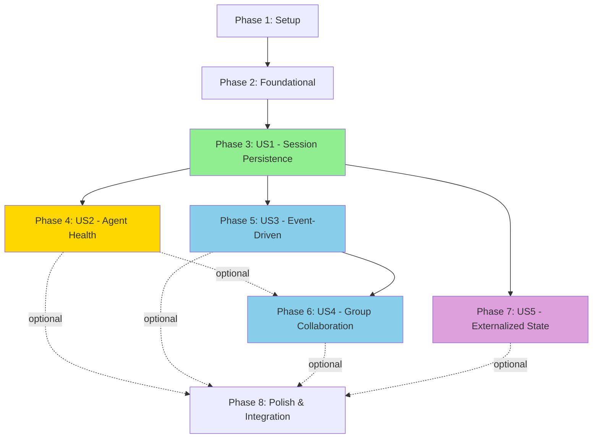

# Implementation Tasks: Production Robustness Enhancements

**Feature**: Production Robustness Enhancements
**Branch**: `001-production-robustness`
**Date**: 2025-11-23
**Status**: Ready for Implementation

## Overview

This document provides dependency-ordered, independently testable tasks for implementing session persistence, agent health monitoring, event-driven architecture, and group collaboration features in the SmallTalk framework.

**Key Principles**:
- Tasks organized by user story for independent delivery
- Test-first development (TDD) with contract tests before implementation
- Parallel execution opportunities marked with `[P]`
- Each user story is independently testable
- MVP = User Story 1 (Session Persistence) only

---

## Task Summary

| Phase | User Story | Tasks | Parallelizable |
|-------|------------|-------|----------------|
| Phase 1 | Setup | 6 | 3 |
| Phase 2 | Foundational | 8 | 5 |
| Phase 3 | US1 (Session Persistence) | 12 | 6 |
| Phase 4 | US2 (Agent Health) | 10 | 5 |
| Phase 5 | US3 (Event-Driven) | 11 | 6 |
| Phase 6 | US4 (Group Collaboration) | 9 | 4 |
| Phase 7 | US5 (Externalized State) | 7 | 4 |
| Phase 8 | Polish & Integration | 9 | 3 |
| **Total** | | **72** | **36** |

---

## Dependency Graph



**Legend**:
- 🟢 MVP (P1): User Story 1 - Session Persistence
- 🟡 P1: User Story 2 - Agent Health
- 🔵 P2: User Stories 3 & 4 - Event-Driven & Group Collaboration
- 🟣 P3: User Story 5 - Externalized State

---

## Phase 1: Setup

**Goal**: Initialize project structure, dependencies, and type definitions.

**Tasks**:

- [ ] T001 Create `src/types/robustness.ts` with Session, AgentHealthStatus, Event, EventReplayPolicy, GroupConversation, StateVersion, RecoveryStrategy types
- [ ] T002 Install dependencies: `better-sqlite3` (session storage), `@types/better-sqlite3` (TypeScript types)
- [ ] T003 [P] Create `src/persistence/` directory for storage adapters
- [ ] T004 [P] Create `tests/contract/` directory for contract test suites
- [ ] T005 [P] Create `tests/integration/` directory for integration tests
- [ ] T006 Update `package.json` with new exports for robustness modules

---

## Phase 2: Foundational (Blocking Prerequisites)

**Goal**: Implement storage adapter pattern and base infrastructure needed by all user stories.

**Independent Test**: Create a FileStorageAdapter, save a test session, retrieve it, and verify data integrity.

**Tasks**:

### Storage Adapter Contract

- [ ] T007 Create `src/persistence/StorageAdapter.interface.ts` from `specs/001-production-robustness/contracts/StorageAdapter.contract.ts`
- [ ] T008 Create contract test suite in `tests/contract/storage-adapter.contract.test.ts` with 18 tests (initialize, saveSession, getSession, deleteSession, listSessions, hasSession, set, get, delete, has, clear, getStats)

### Storage Adapter Implementations

- [ ] T009 [P] Implement `src/persistence/InMemoryStorageAdapter.ts` (for testing) - Run contract tests
- [ ] T010 [P] Implement `src/persistence/FileStorageAdapter.ts` with better-sqlite3 - Run contract tests
- [ ] T011 [P] Create `src/persistence/StorageAdapterFactory.ts` to create adapters by type
- [ ] T012 Verify all adapters pass contract test suite (18/18 tests green)

### Core Type Export

- [ ] T013 [P] Export all robustness types from `src/index.ts`
- [ ] T014 [P] Create barrel export file `src/persistence/index.ts` for adapter exports

---

## Phase 3: User Story 1 - Session Persistence and Recovery (P1) 🟢

**Goal**: Enable conversations to survive system restarts with full state recovery.

**Why this priority**: Most critical gap preventing production readiness. Without session persistence, all conversations lost on restart.

**Independent Test**: Start a multi-agent conversation, save the session ID, restart the SmallTalk application, restore the session using `restoreSession(sessionId)`, and verify the conversation continues with full context preserved (conversation history, agent states, metadata).

**Test File**: `tests/integration/session-persistence.integration.test.ts`

**Tasks**:

### Contract & Tests

- [ ] T015 [US1] Create `src/core/SessionManager.interface.ts` from `specs/001-production-robustness/contracts/SessionManager.contract.ts`
- [ ] T016 [US1] Create contract test suite in `tests/contract/session-manager.contract.test.ts` with tests for createSession, saveSession, restoreSession, deleteSession, listSessions, updateSessionState, addMessage, updateAgentState, cleanupExpiredSessions, getStats
- [ ] T017 [US1] Create integration test `tests/integration/session-persistence.integration.test.ts` - Test Scenario 1 (conversation restart recovery)

### Implementation

- [ ] T018 [P] [US1] Implement `src/core/SessionManager.ts` class with StorageAdapter dependency injection
- [ ] T019 [P] [US1] Implement `createSession(options)` method - Assign unique UUID, set expiration, return Session object
- [ ] T020 [P] [US1] Implement `saveSession(session)` method - Serialize to storage, meet <50ms SC-009
- [ ] T021 [US1] Implement `restoreSession(sessionId)` method - Deserialize from storage, meet <100ms SC-007
- [ ] T022 [US1] Implement `deleteSession(sessionId)` method - Remove from storage
- [ ] T023 [US1] Implement `listSessions(options)` method - Query with filtering
- [ ] T024 [P] [US1] Implement `updateSessionState(sessionId, state)` method - Transition session state
- [ ] T025 [P] [US1] Implement `addMessage(sessionId, message)` method - Append to conversation history
- [ ] T026 [P] [US1] Implement `updateAgentState(sessionId, agentId, state)` method - Update agent in session

### Cleanup & Validation

- [ ] T027 [US1] Implement `cleanupExpiredSessions(expirationMs)` method - Delete expired sessions, return count (FR-004)
- [ ] T028 [US1] Implement `getStats()` method - Return SessionStorageStats (FR-037)
- [ ] T029 [US1] Run all contract tests - Verify 100% pass rate
- [ ] T030 [US1] Run integration test - Verify scenario 1 passes (restart recovery)

---

## Phase 4: User Story 2 - Agent Disconnection Detection and Recovery (P1) 🟡

**Goal**: Automatically detect agent failures and recover without manual intervention.

**Why this priority**: Agent failures create orphaned conversations and poor user experiences. Automatic recovery essential for production reliability.

**Independent Test**: Start an agent conversation, simulate an agent crash (process.exit or network timeout), verify the system detects the failure within 5 seconds, and either restarts the agent with restored state or assigns a replacement while preserving conversation continuity.

**Test File**: `tests/integration/agent-health-recovery.integration.test.ts`

**Tasks**:

### Contract & Tests

- [ ] T031 [US2] Create `src/core/AgentHealthMonitor.interface.ts` from `specs/001-production-robustness/contracts/AgentHealthMonitor.contract.ts`
- [ ] T032 [US2] Create contract test suite in `tests/contract/agent-health-monitor.contract.test.ts` with tests for initialize, registerAgent, unregisterAgent, startMonitoring, stopMonitoring, getAgentHealth, getAllAgentHealth, sendHeartbeat, recordActivity, recoverAgent, setRecoveryStrategy, getStats
- [ ] T033 [US2] Create integration test `tests/integration/agent-health-recovery.integration.test.ts` - Test Scenario 1 (agent crash detection and recovery)

### Implementation

- [ ] T034 [P] [US2] Implement `src/core/AgentHealthMonitor.ts` class with hybrid event + timeout heartbeat mechanism (research.md Section 5)
- [ ] T035 [P] [US2] Implement `initialize(config)` method - Set heartbeatInterval (2s), activityTimeout (5s), maxMissedBeats (2)
- [ ] T036 [P] [US2] Implement `registerAgent(agent, recoveryStrategy)` method - Add agent to monitoring with strategy
- [ ] T037 [US2] Implement `startMonitoring()` method - Start heartbeat timers, meet <1% CPU SC-010
- [ ] T038 [US2] Implement `sendHeartbeat(agentId)` and `recordActivity(agentId, activityType)` methods - Update lastHeartbeat/lastActivity timestamps
- [ ] T039 [US2] Implement heartbeat failure detection - Trigger on 2 missed heartbeats within 5s (SC-003)
- [ ] T040 [US2] Implement `recoverAgent(agentId)` method - Execute recovery strategy (restart/replace/alert), meet 90% success SC-004

### Validation

- [ ] T041 [US2] Implement `getAgentHealth(agentId)` and `getAllAgentHealth()` methods - Return AgentHealthStatus
- [ ] T042 [US2] Implement `getStats()` method - Return MonitoringStats with CPU overhead tracking
- [ ] T043 [US2] Run all contract tests - Verify 100% pass rate
- [ ] T044 [US2] Run integration test - Verify scenario 1 passes (5-second detection, 90% recovery)

---

## Phase 5: User Story 3 - Event-Driven Agent Communication (P2) 🔵

**Goal**: Enable agents to react automatically to conversation events without explicit routing.

**Why this priority**: Event-driven patterns enable organic agent collaboration and reduce tight coupling. Makes SmallTalk more agentic and scalable.

**Independent Test**: Configure agents to subscribe to "task:completed" topic, trigger an event by having one agent publish a task completion message, and verify subscribed agents receive the event within 10ms and react automatically without explicit routing.

**Test File**: `tests/integration/event-driven-communication.integration.test.ts`

**Tasks**:

### Contract & Tests

- [ ] T045 [US3] Create `src/core/EventBus.interface.ts` from `specs/001-production-robustness/contracts/EventBus.contract.ts`
- [ ] T046 [US3] Create contract test suite in `tests/contract/event-bus.contract.test.ts` with tests for publish, subscribe, unsubscribe, unsubscribeAll, replay, setReplayPolicy, getReplayPolicy, clearEventHistory, getStats
- [ ] T047 [US3] Create integration test `tests/integration/event-driven-communication.integration.test.ts` - Test Scenario 1 (pub/sub with <10ms latency)

### Implementation

- [ ] T048 [P] [US3] Implement `src/core/EventBus.ts` class extending Node.js EventEmitter (research.md Section 1)
- [ ] T049 [P] [US3] Implement file-based event replay storage with JSON Lines + in-memory index (research.md Section 6)
- [ ] T050 [P] [US3] Implement `publish(topic, payload, options)` method - Emit event, persist for replay, meet <10ms SC-008
- [ ] T051 [US3] Implement `subscribe(topic, subscriberId, handler, options)` method - Register handler with wildcard support (e.g., 'agent:*')
- [ ] T052 [US3] Implement `unsubscribe(topic, subscriberId)` and `unsubscribeAll(subscriberId)` methods
- [ ] T053 [US3] Implement `replay(subscriberId, options)` method - Replay missed events based on policy, meet <200ms SC-011

### Event Replay Policies

- [ ] T054 [P] [US3] Implement `setReplayPolicy(subscriberId, policy)` method - Configure none/full/critical-only (FR-016a/b/c)
- [ ] T055 [P] [US3] Implement `getReplayPolicy(subscriberId)` method - Return current policy (default: critical-only)
- [ ] T056 [US3] Implement `clearEventHistory(sessionId, olderThan)` method - Cleanup expired events
- [ ] T057 [US3] Implement `getStats()` method - Return EventBusStats with propagation latency tracking
- [ ] T058 [US3] Run all contract tests - Verify 100% pass rate
- [ ] T059 [US3] Run integration test - Verify scenario 1 passes (<10ms delivery, wildcard subscriptions work)

---

## Phase 6: User Story 4 - Group Conversation Collaboration (P2) 🔵

**Goal**: Enable multiple agents to collaborate simultaneously in shared conversations.

**Why this priority**: True multi-agent collaboration unlocks SmallTalk's full potential. Sequential one-at-a-time agents limit collaborative capabilities.

**Independent Test**: Create a group conversation with 3 agents (Researcher, Writer, Reviewer), send a complex query requiring multiple perspectives ("What are the key challenges in AI alignment?"), and verify agents collaborate naturally with appropriate LLM-based speaker selection (<100ms) and shared context access.

**Test File**: `tests/integration/group-collaboration.integration.test.ts`

**Tasks**:

### Contract & Tests

- [ ] T060 [US4] Create `src/core/GroupConversationManager.interface.ts` from `specs/001-production-robustness/contracts/GroupConversationManager.contract.ts`
- [ ] T061 [US4] Create contract test suite in `tests/contract/group-conversation-manager.contract.test.ts` with tests for createGroup, addAgent, removeAgent, handleMessage, selectSpeaker, setSelectionStrategy, getConversation, updateSharedContext, endConversation, getStats
- [ ] T062 [US4] Create integration test `tests/integration/group-collaboration.integration.test.ts` - Test Scenario 1 (3-agent group with LLM-based speaker selection)

### Implementation

- [ ] T063 [P] [US4] Implement `src/core/GroupConversationManager.ts` class
- [ ] T064 [P] [US4] Implement `createGroup(agents, options)` method - Initialize GroupConversation with speakerSelection strategy (round-robin/llm-based/priority)
- [ ] T065 [US4] Implement `selectSpeaker(conversationId, context)` method - Return SpeakerSelectionResult with confidence/reasoning, meet <100ms SC-012
- [ ] T066 [P] [US4] Implement LLM-based speaker selection using Token.js (FR-018, SC-013: 90% contextually appropriate)
- [ ] T067 [P] [US4] Implement `handleMessage(conversationId, userMessage)` method - Orchestrate speaker selection and agent responses

### Group Management

- [ ] T068 [US4] Implement `addAgent(conversationId, agent)` and `removeAgent(conversationId, agentId)` methods - Enforce 10-agent max (FR-036)
- [ ] T069 [US4] Implement `updateSharedContext(conversationId, contextUpdate)` method - Merge context updates (FR-019)
- [ ] T070 [US4] Implement `getStats()` method - Return GroupConversationStats with success rate tracking
- [ ] T071 [US4] Run all contract tests - Verify 100% pass rate
- [ ] T072 [US4] Run integration test - Verify scenario 1 passes (3-agent collaboration, speaker selection <100ms, 90% appropriate selections)

---

## Phase 7: User Story 5 - Externalized State Management (P3) 🟣

**Goal**: Store agent state externally to enable distributed architectures and better debugging.

**Why this priority**: Important for distributed systems, but can be delivered after core persistence and recovery features.

**Independent Test**: Configure external state storage (FileStorageAdapter), run an agent that modifies state (key-value pairs), restart the agent process, and verify the agent loads the correct state from external storage using `storageAdapter.get(key)`.

**Test File**: `tests/integration/externalized-state.integration.test.ts`

**Tasks**:

### State Versioning

- [ ] T073 [P] [US5] Implement `src/core/StateVersionManager.ts` class for state versioning (FR-028)
- [ ] T074 [P] [US5] Implement `createVersion(entityId, snapshot)` method - Create StateVersion with version number, timestamp
- [ ] T075 [P] [US5] Implement `getVersion(entityId, version)` method - Retrieve specific state version

### State Conflict Resolution

- [ ] T076 [US5] Implement `resolveConflict(entityId, versions)` method - Last-write-wins or merge strategies (FR-030)
- [ ] T077 [US5] Create integration test `tests/integration/externalized-state.integration.test.ts` - Test Scenario 1 (state persistence across restart)
- [ ] T078 [US5] Implement state synchronization interval for distributed agents (FR-029)

### Validation

- [ ] T079 [US5] Test state versioning - Verify version tracking works across multiple updates
- [ ] T080 [US5] Test conflict resolution - Verify last-write-wins strategy resolves concurrent updates
- [ ] T081 [US5] Run integration test - Verify scenario 1 passes (state loads correctly after restart)

---

## Phase 8: Polish & Cross-Cutting Concerns

**Goal**: Production hardening, performance validation, and cross-feature integration.

**Tasks**:

### Integration & End-to-End Testing

- [ ] T082 Create `tests/e2e/production-robustness.e2e.test.ts` - Test all features together (session + health + events + groups)
- [ ] T083 Test session persistence with agent health recovery - Verify conversation continuity during agent failures
- [ ] T084 Test event-driven patterns with group collaboration - Verify events trigger appropriate group member actions

### Performance Validation

- [ ] T085 [P] Benchmark session restore latency - Verify <100ms for 100-message sessions (SC-007)
- [ ] T086 [P] Benchmark event propagation - Verify <10ms delivery (SC-008)
- [ ] T087 [P] Benchmark heartbeat CPU overhead - Verify <1% with 100 agents (SC-010)

### Documentation & Examples

- [ ] T088 Create quickstart example in `examples/production-robustness.ts` demonstrating all features
- [ ] T089 Update main README.md with production robustness features section
- [ ] T090 Create migration guide for existing SmallTalk applications to adopt persistence

---

## Parallel Execution Examples

### Phase 3 (US1 - Session Persistence)
```bash
# Parallel implementation after contract tests pass
T018, T019, T020 can run in parallel (different methods)
T024, T025, T026 can run in parallel (different methods)
```

### Phase 4 (US2 - Agent Health)
```bash
# Parallel implementation after contract tests pass
T034, T035, T036 can run in parallel (different methods)
```

### Phase 5 (US3 - Event-Driven)
```bash
# Parallel implementation after contract tests pass
T048, T049, T050 can run in parallel (EventBus core + storage + publish)
T054, T055 can run in parallel (replay policy getters/setters)
```

### Phase 6 (US4 - Group Collaboration)
```bash
# Parallel implementation after contract tests pass
T063, T064 can run in parallel (manager + createGroup)
T066, T067 can run in parallel (LLM selection + handleMessage)
```

---

## Implementation Strategy

### MVP Scope (Minimum Viable Product)
**Recommended for first release: Phase 3 (User Story 1) only**

- ✅ Session Persistence and Recovery
- ✅ Storage adapters (InMemory, File)
- ✅ Basic session CRUD operations
- ✅ Expiration policies

**Delivers**: Conversations survive restarts (most critical production gap)

### Incremental Delivery Milestones

**Milestone 1 (MVP)**: Phases 1-3 → Session Persistence
- **Deliverable**: Applications can save/restore conversations
- **Test**: Restart application mid-conversation, verify seamless resumption
- **Timeline**: Foundational + US1 = 26 tasks

**Milestone 2**: Add Phase 4 → Agent Health Monitoring
- **Deliverable**: Automatic agent failure detection and recovery
- **Test**: Kill agent process, verify automatic recovery
- **Timeline**: +10 tasks (cumulative: 36)

**Milestone 3**: Add Phases 5-6 → Event-Driven + Group Collaboration
- **Deliverable**: Reactive agents and multi-agent conversations
- **Test**: Publish event, verify subscribed agents react; 3-agent group collaboration
- **Timeline**: +20 tasks (cumulative: 56)

**Milestone 4**: Add Phase 7 → Externalized State Management
- **Deliverable**: Distributed state with versioning
- **Test**: Distributed agents share state
- **Timeline**: +7 tasks (cumulative: 63)

**Milestone 5**: Add Phase 8 → Production Polish
- **Deliverable**: Performance-validated, documented, production-ready
- **Test**: End-to-end scenarios pass
- **Timeline**: +9 tasks (total: 72)

---

## Task Validation Checklist

✅ All 72 tasks follow checklist format: `- [ ] [TaskID] [P?] [Story?] Description with file path`
✅ Tasks organized by user story (US1-US5) for independent delivery
✅ Each user story has independent test criteria
✅ Dependency graph shows story completion order
✅ Parallel execution examples provided per story
✅ MVP scope clearly defined (US1 only)
✅ Contract tests specified before implementation (TDD)
✅ File paths included in all implementation tasks
✅ Performance criteria referenced (SC-007, SC-008, SC-010, etc.)

---

**Next Steps**: Begin with Phase 1 (Setup), then Phase 2 (Foundational), then implement User Story 1 (MVP). Run contract tests before each implementation phase (Red-Green-Refactor cycle).

**Status**: ✅ Ready for Implementation
